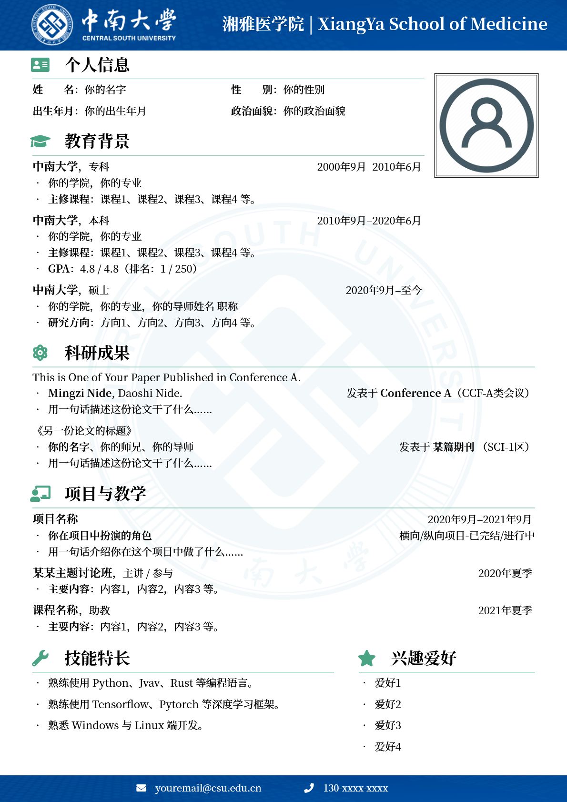

# CSU-CV：中南大学 LaTeX 中文简历模板



## 简介

本模板基于：
- [nnu-cv-latex-template](https://github.com/Reborn14/nnu-cv-latex-template)

在原有内容的基础上进行了修改：

- 更改了校徽图标和装饰图案
- 调整了装饰图案的色彩风格

## 文件结构

```
.
├── fonts/          # 字体文件
├── images/         # 图片资源
├── main.tex        # 主模板文件
└── main_annot.tex  # 带注释的模板文件
```

## 使用方法

1. 克隆本仓库：
```bash
git clone https://github.com/Dunsky343/CSU-cv-latex-template.git
```

2. 编辑 `main.tex` 中的内容，对文档样式和内容进行修改：
   - 修改个人信息
   - 更新教育背景
   - 添加科研成果
   - 更新项目经历
   - 其他自定义内容

3. 使用 `XeLaTeX` 或 `LuaLaTeX` 编译：
   - 推荐使用 Overleaf 在线编译
   - 或使用本地 TeX 发行版（如 TeX Live）编译

## 注意事项

- 本模板需要 `XeLaTeX` 或 `LuaLaTeX` 编译器
- 需要安装 `NotoSerifSC` 字体（已包含在 `fonts` 目录中）
- 编译时请确保所有依赖包都已正确安装

## 许可证

本项目采用 [MIT License](LICENSE) 进行许可。

## 致谢
本模板基于[Reborn14](https://github.com/Reborn14)开源的 [nnu-cv-latex-template](https://github.com/Reborn14/nnu-cv-latex-template)模板修改而来。感谢原作者出色的底层排版工作！